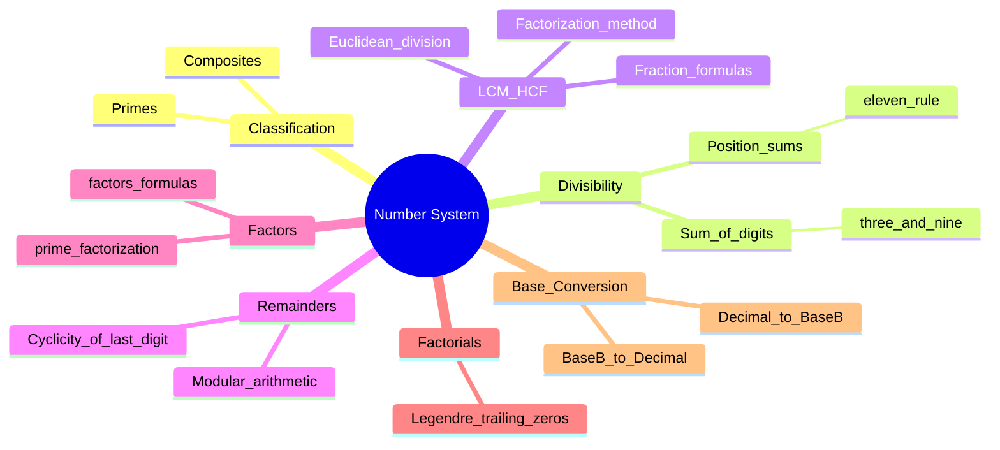

# Number System — Mind Map

```mermaid
mindmap
  root((Number System))
    Classification
      Primes
      Composites
    Divisibility
      Sum_of_digits
        three_and_nine
      Position_sums
        eleven_rule
    LCM_HCF
      Factorization_method
      Euclidean_division
      Fraction_formulas
    Remainders
      Modular_arithmetic
      Cyclicity_of_last_digit
    Factors
      prime_factorization
      factors_formulas
    Factorials
      Legendre_trailing_zeros
    Base_Conversion
      Decimal_to_BaseB
      BaseB_to_Decimal
```
