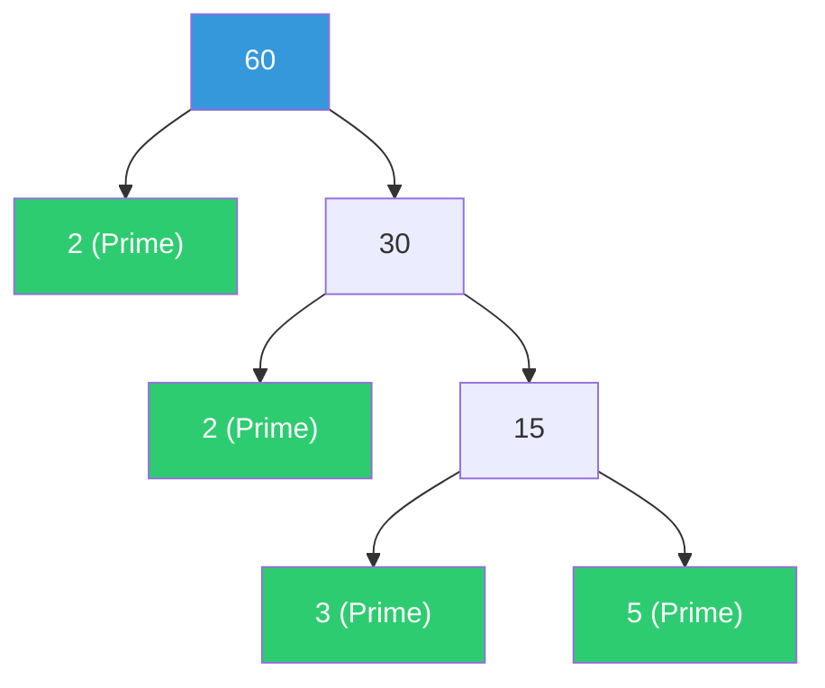
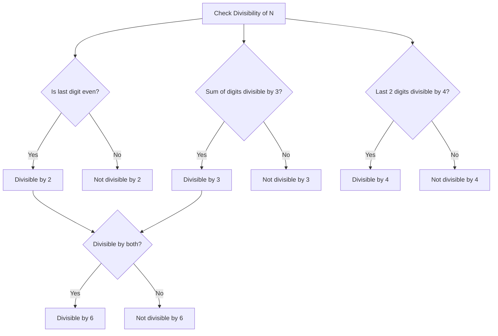
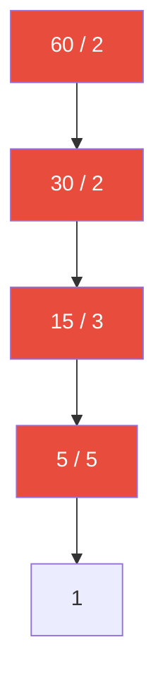

# Number System — Visualization

---

## 1. Factor Tree Diagram (Composite Number 60)

---

## 2. Divisibility Rule Flowchart

---

## 3. "Prime Ladder" Diagram for Prime Factorization (For 60)

*(Divide by prime numbers step-by-step down to 1: $60 = 2^2 \times 3^1 \times 5^1$).*
