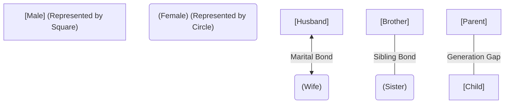
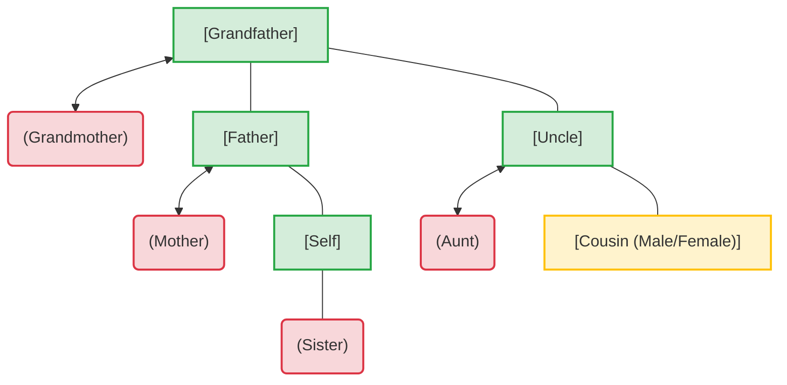

# Family Tree Visualization

Below are visual representations of family trees using Mermaid diagrams.

## 1. Key Legend

Before drawing a family tree, understand the visual notation:

---

## 2. Standard 3-Generation Family Tree

Here is a visual map of a typical family structure covering Grandparents, Parents, Uncles/Aunts, Children, and Cousins.

