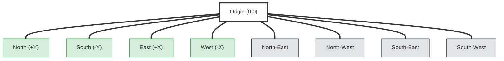

# Direction Sense Visualization

Below is the cardinal and intercardinal direction layout represented using a coordinate-like Mermaid diagram.

## The Direction Coordinate Map

```mermaid
graph TD
    %% Define Nodes
    N["North (+Y)"]
    S["South (-Y)"]
    E["East (+X)"]
    W["West (-X)"]
    
    NE["North-East"]
    NW["North-West"]
    SE["South-East"]
    SW["South-West"]
    
    Origin["Origin (0,0)"]
    
    %% Relationships representing direction layout
    Origin === N
    Origin === S
    Origin === E
    Origin === W
    
    Origin === NE
    Origin === NW
    Origin === SE
    Origin === SW
    
    %% Styling
    style Origin fill:#fff,stroke:#333,stroke-width:3px
    style N fill:#d4edda,stroke:#28a745,stroke-width:1px
    style S fill:#d4edda,stroke:#28a745,stroke-width:1px
    style E fill:#d4edda,stroke:#28a745,stroke-width:1px
    style W fill:#d4edda,stroke:#28a745,stroke-width:1px
    
    style NE fill:#e2e3e5,stroke:#383d41,stroke-width:1px
    style NW fill:#e2e3e5,stroke:#383d41,stroke-width:1px
    style SE fill:#e2e3e5,stroke:#383d41,stroke-width:1px
    style SW fill:#e2e3e5,stroke:#383d41,stroke-width:1px
```
