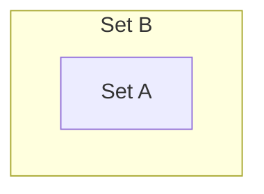
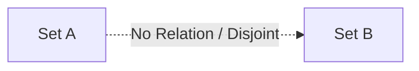
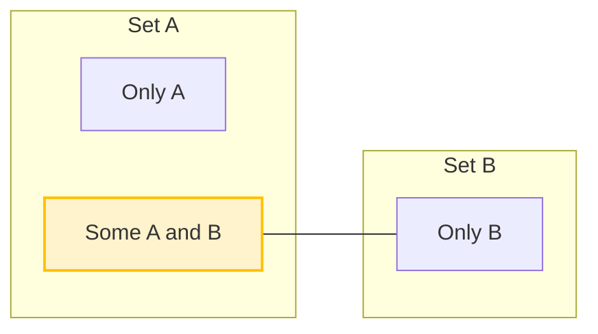

# Syllogism Venn Diagram Visualizations

Below are the standard representations of categorical propositions using Mermaid diagrams.

## 1. Universal Positive: "All A are B"

This shows set $A$ is entirely contained within set $B$ ($A \subseteq B$).

---

## 2. Universal Negative: "No A are B"

This shows set $A$ and set $B$ are completely disjoint ($A \cap B = \emptyset$).

---

## 3. Particular Positive: "Some A are B"

This shows that there is an intersection between set $A$ and set $B$ ($A \cap B \neq \emptyset$).

