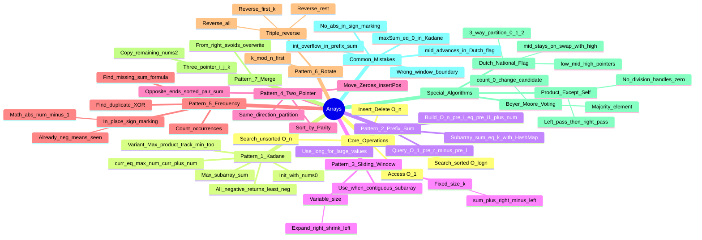

# Arrays — Mind Map

```mermaid
mindmap
  root((Arrays))
    Core_Operations
      Access O_1
      Insert_Delete O_n
      Search_unsorted O_n
      Search_sorted O_logn
    Pattern_1_Kadane
      Max_subarray_sum
      Init_with_nums0
      curr_eq_max_num_curr_plus_num
      All_negative_returns_least_neg
      Variant_Max_product_track_min_too
    Pattern_2_Prefix_Sum
      Build_O_n_pre_i_eq_pre_i1_plus_num
      Query_O_1_pre_r_minus_pre_l
      Subarray_sum_eq_k_with_HashMap
      Use_long_for_large_values
    Pattern_3_Sliding_Window
      Fixed_size_k
        sum_plus_right_minus_left
      Variable_size
        Expand_right_shrink_left
      Use_when_contiguous_subarray
    Pattern_4_Two_Pointer
      Opposite_ends_sorted_pair_sum
      Same_direction_partition
      Move_Zeroes_insertPos
      Sort_by_Parity
    Pattern_5_Frequency
      Count_occurrences
      Find_missing_sum_formula
      Find_duplicate_XOR
      In_place_sign_marking
        Math_abs_num_minus_1
        Already_neg_means_seen
    Pattern_6_Rotate
      k_mod_n_first
      Triple_reverse
        Reverse_all
        Reverse_first_k
        Reverse_rest
    Pattern_7_Merge
      From_right_avoids_overwrite
      Three_pointer_i_j_k
      Copy_remaining_nums2
    Special_Algorithms
      Dutch_National_Flag
        3_way_partition_0_1_2
        low_mid_high_pointers
        mid_stays_on_swap_with_high
      Boyer_Moore_Voting
        Majority_element
        count_0_change_candidate
      Product_Except_Self
        Left_pass_then_right_pass
        No_division_handles_zero
    Common_Mistakes
      maxSum_eq_0_in_Kadane
      No_abs_in_sign_marking
      Wrong_window_boundary
      mid_advances_in_Dutch_flag
      int_overflow_in_prefix_sum
```
