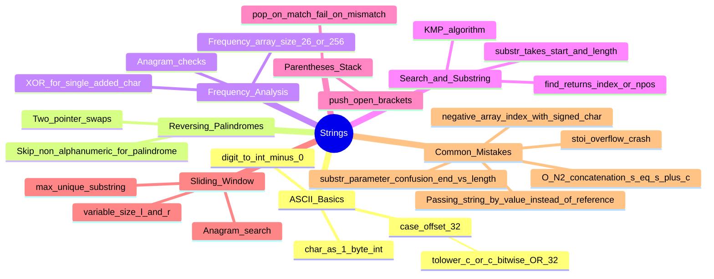

# Strings — Mind Map

```mermaid
mindmap
  root((Strings))
    ASCII_Basics
      char_as_1_byte_int
      case_offset_32
        tolower_c_or_c_bitwise_OR_32
      digit_to_int_minus_0
    Reversing_Palindromes
      Two_pointer_swaps
      Skip_non_alphanumeric_for_palindrome
    Frequency_Analysis
      Frequency_array_size_26_or_256
      Anagram_checks
      XOR_for_single_added_char
    Search_and_Substring
      find_returns_index_or_npos
      substr_takes_start_and_length
      KMP_algorithm
    Parentheses_Stack
      push_open_brackets
      pop_on_match_fail_on_mismatch
    Sliding_Window
      variable_size_l_and_r
      max_unique_substring
      Anagram_search
    Common_Mistakes
      O_N2_concatenation_s_eq_s_plus_c
      Passing_string_by_value_instead_of_reference
      stoi_overflow_crash
      substr_parameter_confusion_end_vs_length
      negative_array_index_with_signed_char
```
