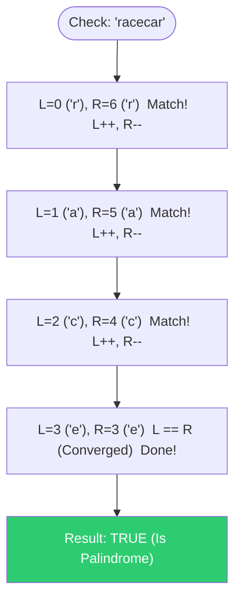
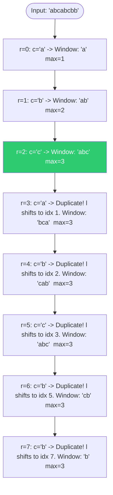

# Strings — Visualization

## Diagram 1 — Palindrome Check (Two Pointer)


```mermaid
flowchart TD
    Start(["Check: 'racecar'"])
    Start --> P1["L=0 ('r'), R=6 ('r')  Match!  L++, R--"]
    P1 --> P2["L=1 ('a'), R=5 ('a')  Match!  L++, R--"]
    P2 --> P3["L=2 ('c'), R=4 ('c')  Match!  L++, R--"]
    P3 --> P4["L=3 ('e'), R=3 ('e')  L == R (Converged)  Done!"]
    P4 --> Result["Result: TRUE (Is Palindrome)"]

    style Result fill:#2ecc71,color:#fff
```

---

## Diagram 2 — Sliding Window (Longest Substring Without Repeating)


```mermaid
flowchart TD
    Start2(["Input: 'abcabcbb'"])
    Start2 --> W0["r=0: c='a' -> Window: 'a'  max=1"]
    W0 --> W1["r=1: c='b' -> Window: 'ab'  max=2"]
    W1 --> W2["r=2: c='c' -> Window: 'abc'  max=3"]
    W2 --> W3["r=3: c='a' -> Duplicate! l shifts to idx 1. Window: 'bca'  max=3"]
    W3 --> W4["r=4: c='b' -> Duplicate! l shifts to idx 2. Window: 'cab'  max=3"]
    W4 --> W5["r=5: c='c' -> Duplicate! l shifts to idx 3. Window: 'abc'  max=3"]
    W5 --> W6["r=6: c='b' -> Duplicate! l shifts to idx 5. Window: 'cb'  max=3"]
    W6 --> W7["r=7: c='b' -> Duplicate! l shifts to idx 7. Window: 'b'  max=3"]

    style W2 fill:#2ecc71,color:#fff
```
```
