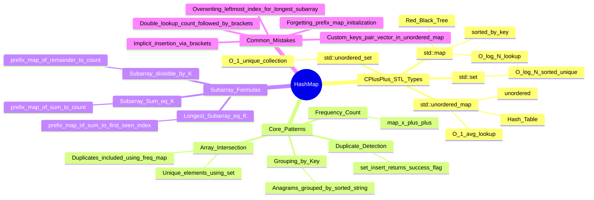

# HashMap — Mind Map

```mermaid
mindmap
  root((HashMap))
    CPlusPlus_STL_Types
      std::unordered_map
        Hash_Table
        O_1_avg_lookup
        unordered
      std::map
        Red_Black_Tree
        O_log_N_lookup
        sorted_by_key
      std::unordered_set
        O_1_unique_collection
      std::set
        O_log_N_sorted_unique
    Core_Patterns
      Frequency_Count
        map_x_plus_plus
      Duplicate_Detection
        set_insert_returns_success_flag
      Array_Intersection
        Unique_elements_using_set
        Duplicates_included_using_freq_map
      Grouping_by_Key
        Anagrams_grouped_by_sorted_string
    Subarray_Formulas
      Subarray_Sum_eq_K
        prefix_map_of_sum_to_count
      Longest_Subarray_eq_K
        prefix_map_of_sum_to_first_seen_index
      Subarray_divisible_by_K
        prefix_map_of_remainder_to_count
    Common_Mistakes
      Implicit_insertion_via_brackets
      Custom_keys_pair_vector_in_unordered_map
      Forgetting_prefix_map_initialization
      Double_lookup_count_followed_by_brackets
      Overwriting_leftmost_index_for_longest_subarray
```
