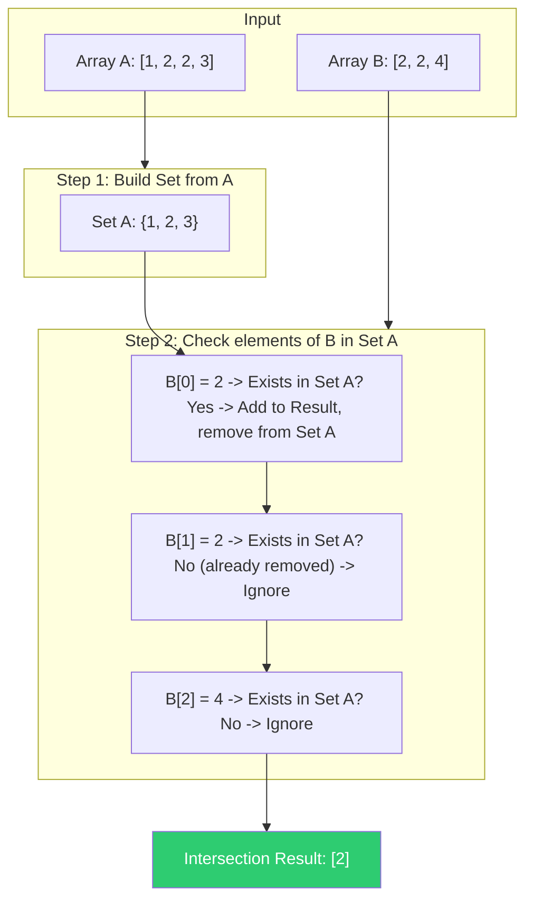
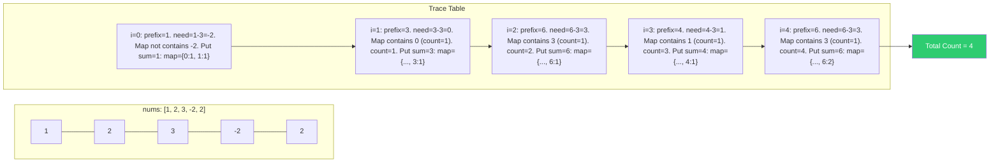

# HashMap — Visualization

## Diagram 1 — Array Intersection (Unique Elements)

```mermaid
flowchart TD
    subgraph Input
        A["Array A: [1, 2, 2, 3]"]
        B["Array B: [2, 2, 4]"]
    end

    subgraph Step_1["Step 1: Build Set from A"]
        SetA["Set A: {1, 2, 3}"]
    end

    subgraph Step_2["Step 2: Check elements of B in Set A"]
        check1["B[0] = 2 -> Exists in Set A? Yes -> Add to Result, remove from Set A"]
        check2["B[1] = 2 -> Exists in Set A? No (already removed) -> Ignore"]
        check3["B[2] = 4 -> Exists in Set A? No -> Ignore"]
    end

    A --> Step_1
    B --> Step_2
    SetA --> check1
    check1 --> check2 --> check3
    check3 --> Result["Intersection Result: [2]"]

    style Result fill:#2ecc71,color:#fff
```

---

## Diagram 2 — Subarray Sum = K using Prefix HashMap (k=3)

```mermaid
flowchart LR
    subgraph Array["nums: [1, 2, 3, -2, 2]"]
        direction LR
        N0["1"] --- N1["2"] --- N2["3"] --- N3["-2"] --- N4["2"]
    end

    subgraph Tracing["Trace Table"]
        T1["i=0: prefix=1. need=1-3=-2. Map not contains -2. Put sum=1: map={0:1, 1:1}"]
        T2["i=1: prefix=3. need=3-3=0. Map contains 0 (count=1). count=1. Put sum=3: map={..., 3:1}"]
        T3["i=2: prefix=6. need=6-3=3. Map contains 3 (count=1). count=2. Put sum=6: map={..., 6:1}"]
        T4["i=3: prefix=4. need=4-3=1. Map contains 1 (count=1). count=3. Put sum=4: map={..., 4:1}"]
        T5["i=4: prefix=6. need=6-3=3. Map contains 3 (count=1). count=4. Put sum=6: map={..., 6:2}"]
    end

    T1 --> T2 --> T3 --> T4 --> T5
    T5 --> Output["Total Count = 4"]

    style Output fill:#2ecc71,color:#fff
```
