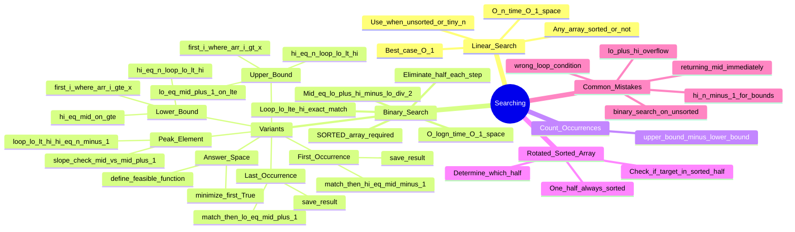

# Searching — Mind Map

```mermaid
mindmap
  root((Searching))
    Linear_Search
      Any_array_sorted_or_not
      O_n_time_O_1_space
      Best_case_O_1
      Use_when_unsorted_or_tiny_n
    Binary_Search
      SORTED_array_required
      O_logn_time_O_1_space
      Mid_eq_lo_plus_hi_minus_lo_div_2
      Loop_lo_lte_hi_exact_match
      Eliminate_half_each_step
      Variants
        Lower_Bound
          first_i_where_arr_i_gte_x
          hi_eq_n_loop_lo_lt_hi
          hi_eq_mid_on_gte
        Upper_Bound
          first_i_where_arr_i_gt_x
          hi_eq_n_loop_lo_lt_hi
          lo_eq_mid_plus_1_on_lte
        First_Occurrence
          match_then_hi_eq_mid_minus_1
          save_result
        Last_Occurrence
          match_then_lo_eq_mid_plus_1
          save_result
        Peak_Element
          slope_check_mid_vs_mid_plus_1
          loop_lo_lt_hi_hi_eq_n_minus_1
        Answer_Space
          define_feasible_function
          minimize_first_True
    Count_Occurrences
      upper_bound_minus_lower_bound
    Rotated_Sorted_Array
      One_half_always_sorted
      Determine_which_half
      Check_if_target_in_sorted_half
    Common_Mistakes
      lo_plus_hi_overflow
      wrong_loop_condition
      hi_n_minus_1_for_bounds
      returning_mid_immediately
      binary_search_on_unsorted
```
