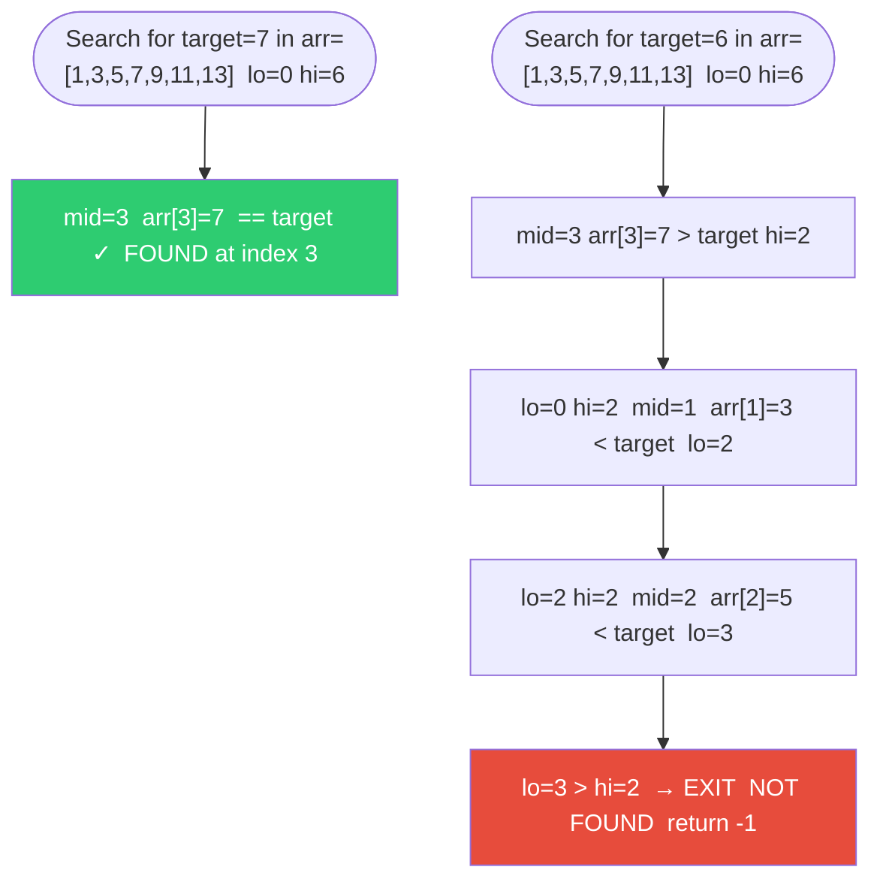
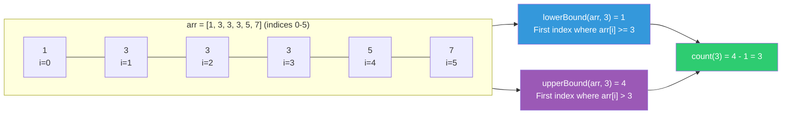
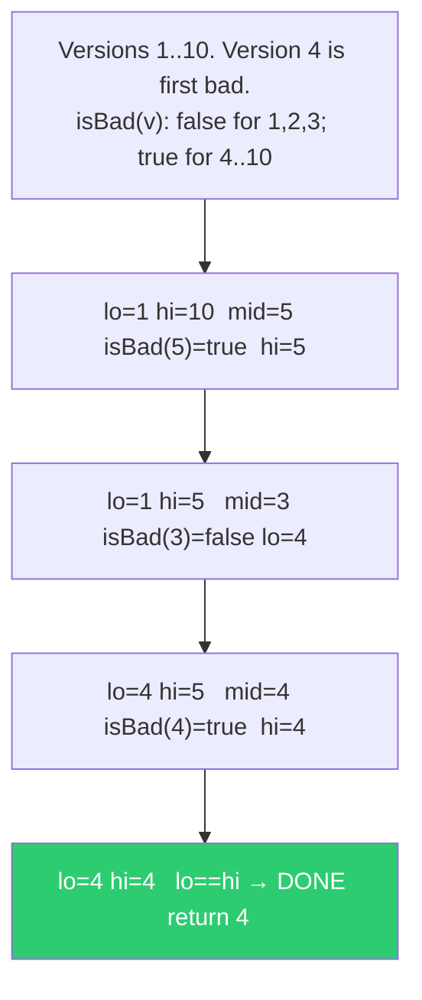
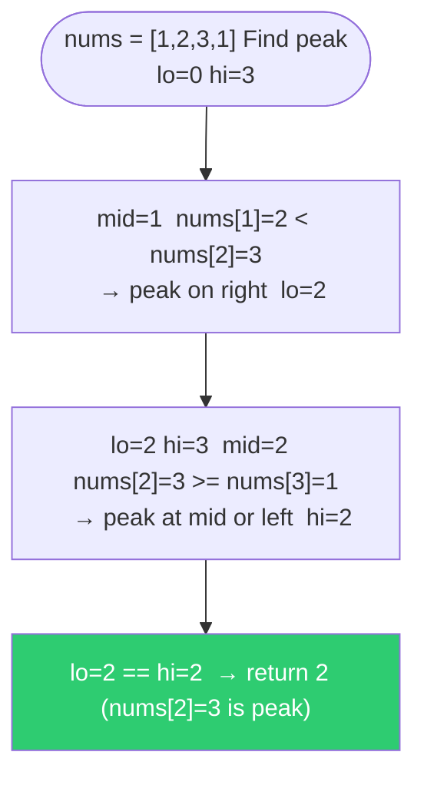

# Searching — Visualization

## Diagram 1 — Binary Search Trace

---

## Diagram 2 — Lower Bound vs Upper Bound

---

## Diagram 3 — First vs Last Occurrence Search

```mermaid
flowchart TD
    subgraph arr2["arr = [2, 4, 4, 4, 7, 9]  Find first and last of 4"]
        direction LR
    end

    subgraph firstOcc["First Occurrence"]
        F1["lo=0 hi=5  mid=2  arr[2]=4 == target\n  result=2  hi=mid-1=1"]
        F2["lo=0 hi=1  mid=0  arr[0]=2 < target\n  lo=mid+1=1"]
        F3["lo=1 hi=1  mid=1  arr[1]=4 == target\n  result=1  hi=mid-1=0"]
        F4["lo=1 > hi=0 → DONE  first=1"]
        F1 --> F2 --> F3 --> F4
    end

    subgraph lastOcc["Last Occurrence"]
        L1["lo=0 hi=5  mid=2  arr[2]=4 == target\n  result=2  lo=mid+1=3"]
        L2["lo=3 hi=5  mid=4  arr[4]=7 > target\n  hi=mid-1=3"]
        L3["lo=3 hi=3  mid=3  arr[3]=4 == target\n  result=3  lo=mid+1=4"]
        L4["lo=4 > hi=3 → DONE  last=3"]
        L1 --> L2 --> L3 --> L4
    end

    style F4 fill:#2ecc71,color:#fff
    style L4 fill:#2ecc71,color:#fff
```

---

## Diagram 4 — Binary Search on Answer Space (First Bad Version)

---

## Diagram 5 — Find Peak Element

