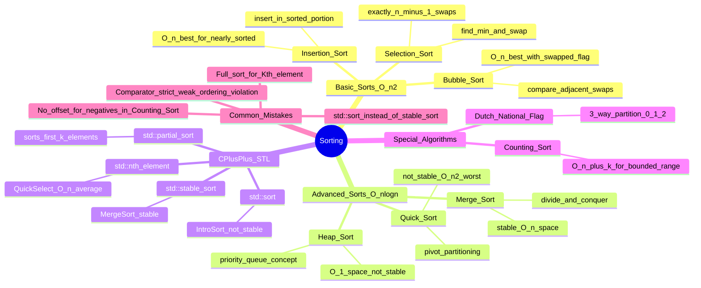

# Sorting — Mind Map

```mermaid
mindmap
  root((Sorting))
    Basic_Sorts_O_n2
      Bubble_Sort
        compare_adjacent_swaps
        O_n_best_with_swapped_flag
      Selection_Sort
        find_min_and_swap
        exactly_n_minus_1_swaps
      Insertion_Sort
        insert_in_sorted_portion
        O_n_best_for_nearly_sorted
    Advanced_Sorts_O_nlogn
      Merge_Sort
        divide_and_conquer
        stable_O_n_space
      Quick_Sort
        pivot_partitioning
        not_stable_O_n2_worst
      Heap_Sort
        priority_queue_concept
        O_1_space_not_stable
    CPlusPlus_STL
      std::sort
        IntroSort_not_stable
      std::stable_sort
        MergeSort_stable
      std::nth_element
        QuickSelect_O_n_average
      std::partial_sort
        sorts_first_k_elements
    Special_Algorithms
      Dutch_National_Flag
        3_way_partition_0_1_2
      Counting_Sort
        O_n_plus_k_for_bounded_range
    Common_Mistakes
      Comparator_strict_weak_ordering_violation
      Full_sort_for_Kth_element
      std::sort_instead_of_stable_sort
      No_offset_for_negatives_in_Counting_Sort
```
