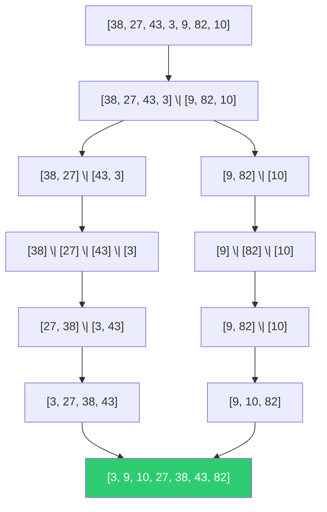
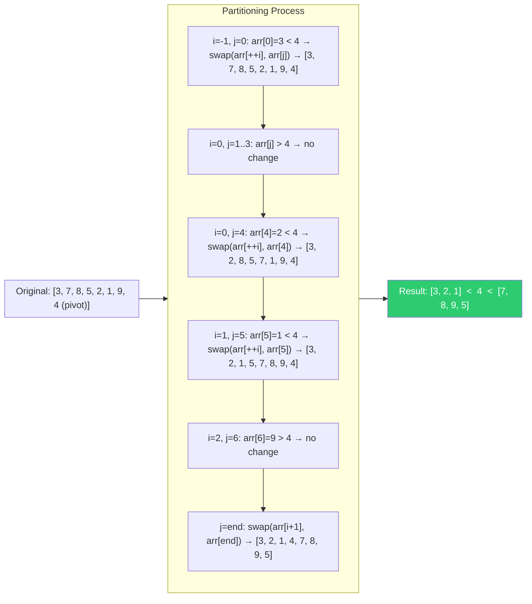

# Sorting — Visualization

## Diagram 1 — Merge Sort (Divide & Conquer)

```mermaid
flowchart TD
    Original["[38, 27, 43, 3, 9, 82, 10]"]
    Original --> Split1["[38, 27, 43, 3]  \|  [9, 82, 10]"]
    Split1 --> Split2a["[38, 27]  \|  [43, 3]"]
    Split1 --> Split2b["[9, 82]  \|  [10]"]
    Split2a --> Split3a["[38]  \|  [27]  \|  [43]  \|  [3]"]
    Split2b --> Split3b["[9]  \|  [82]  \|  [10]"]
    
    Split3a --> Merge1a["[27, 38]  \|  [3, 43]"]
    Split3b --> Merge1b["[9, 82]  \|  [10]"]
    Merge1a --> Merge2a["[3, 27, 38, 43]"]
    Merge1b --> Merge2b["[9, 10, 82]"]
    
    Merge2a --> Merge3["[3, 9, 10, 27, 38, 43, 82]"]
    Merge2b --> Merge3

    style Merge3 fill:#2ecc71,color:#fff
```

---

## Diagram 2 — Quick Sort Partitioning (Pivot = 4)

```mermaid
flowchart LR
    subgraph original["Original: [3, 7, 8, 5, 2, 1, 9, 4 (pivot)]"]
        direction LR
    end

    subgraph partitioning["Partitioning Process"]
        direction TB
        P1["i=-1, j=0: arr[0]=3 < 4 → swap(arr[++i], arr[j]) → [3, 7, 8, 5, 2, 1, 9, 4]"]
        P2["i=0, j=1..3: arr[j] > 4 → no change"]
        P3["i=0, j=4: arr[4]=2 < 4 → swap(arr[++i], arr[4]) → [3, 2, 8, 5, 7, 1, 9, 4]"]
        P4["i=1, j=5: arr[5]=1 < 4 → swap(arr[++i], arr[5]) → [3, 2, 1, 5, 7, 8, 9, 4]"]
        P5["i=2, j=6: arr[6]=9 > 4 → no change"]
        P6["j=end: swap(arr[i+1], arr[end]) → [3, 2, 1, 4, 7, 8, 9, 5]"]
        P1 --> P2 --> P3 --> P4 --> P5 --> P6
    end

    subgraph result["Result: [3, 2, 1]  <  4  <  [7, 8, 9, 5]"]
        direction LR
    end

    original --> partitioning --> result
    style result fill:#2ecc71,color:#fff
```
