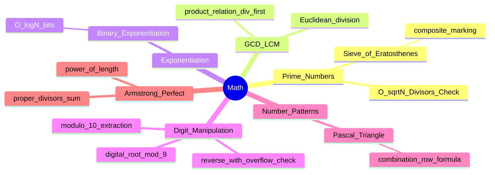

# Math — Mind Map

```mermaid
mindmap
  root((Math))
    Prime_Numbers
      O_sqrtN_Divisors_Check
      Sieve_of_Eratosthenes
        composite_marking
    GCD_LCM
      Euclidean_division
      product_relation_div_first
    Exponentiation
      Binary_Exponentiation
        O_logN_bits
    Digit_Manipulation
      modulo_10_extraction
      reverse_with_overflow_check
      digital_root_mod_9
    Number_Patterns
      Pascal_Triangle
        combination_row_formula
    Armstrong_Perfect
      power_of_length
      proper_divisors_sum
```
