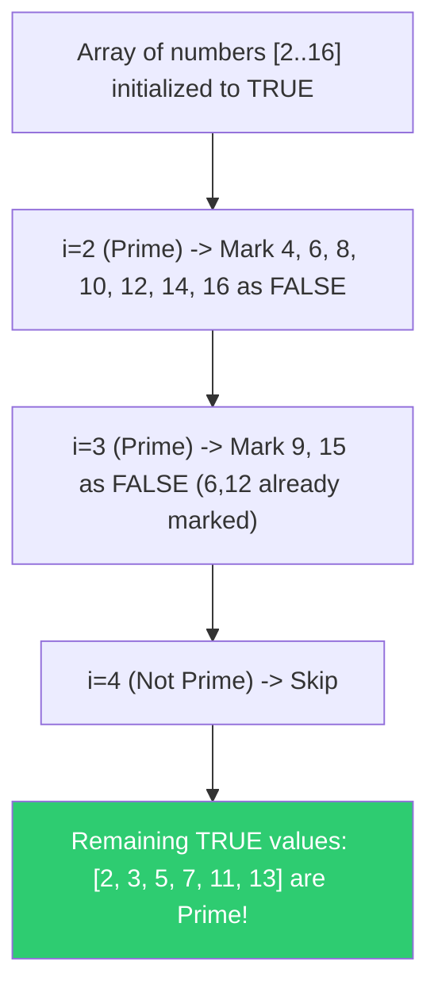
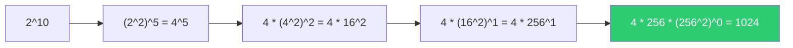

# Math — Visualization

## Diagram 1 — Sieve of Eratosthenes (Prime Sifting)

```mermaid
flowchart TD
    Start["Array of numbers [2..16] initialized to TRUE"]
    Start --> Step2["i=2 (Prime) -> Mark 4, 6, 8, 10, 12, 14, 16 as FALSE"]
    Step2 --> Step3["i=3 (Prime) -> Mark 9, 15 as FALSE (6,12 already marked)"]
    Step3 --> Step4["i=4 (Not Prime) -> Skip"]
    Step4 --> End["Remaining TRUE values: [2, 3, 5, 7, 11, 13] are Prime!"]

    style End fill:#2ecc71,color:#fff
```

---

## Diagram 2 — Binary Exponentiation (Computing $2^{10}$ in 4 steps)

```mermaid
flowchart LR
    Step0["2^10"] --> Step1["(2^2)^5 = 4^5"]
    Step1 --> Step2["4 * (4^2)^2 = 4 * 16^2"]
    Step2 --> Step3["4 * (16^2)^1 = 4 * 256^1"]
    Step3 --> Step4["4 * 256 * (256^2)^0 = 1024"]

    style Step4 fill:#2ecc71,color:#fff
```
