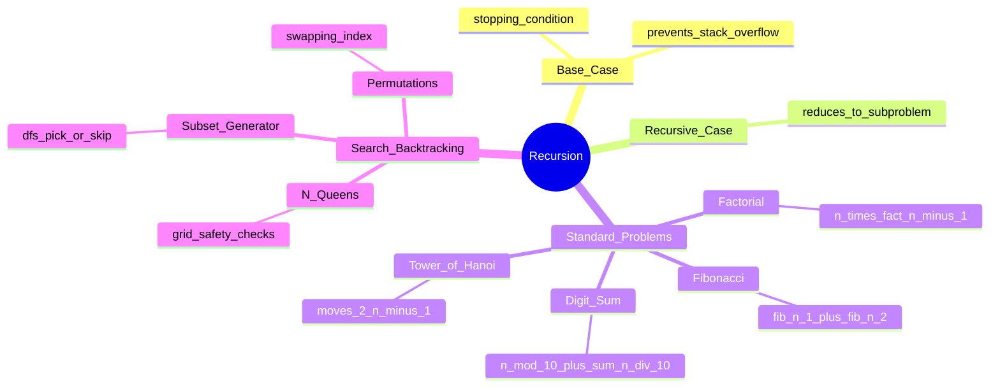

# Recursion — Mind Map

```mermaid
mindmap
  root((Recursion))
    Base_Case
      stopping_condition
      prevents_stack_overflow
    Recursive_Case
      reduces_to_subproblem
    Standard_Problems
      Factorial
        n_times_fact_n_minus_1
      Fibonacci
        fib_n_1_plus_fib_n_2
      Digit_Sum
        n_mod_10_plus_sum_n_div_10
      Tower_of_Hanoi
        moves_2_n_minus_1
    Search_Backtracking
      Subset_Generator
        dfs_pick_or_skip
      Permutations
        swapping_index
      N_Queens
        grid_safety_checks
```
