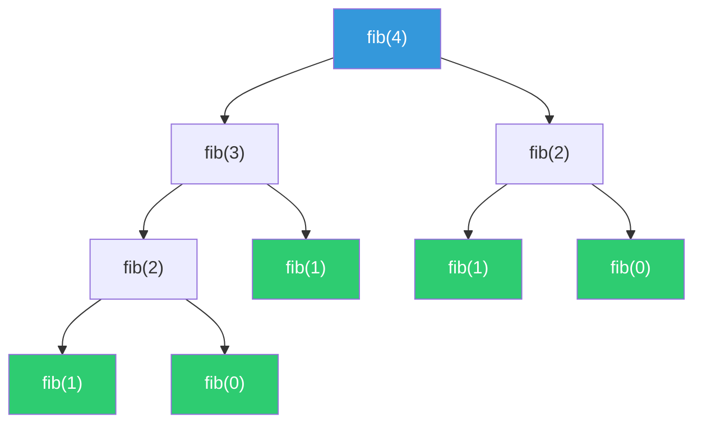
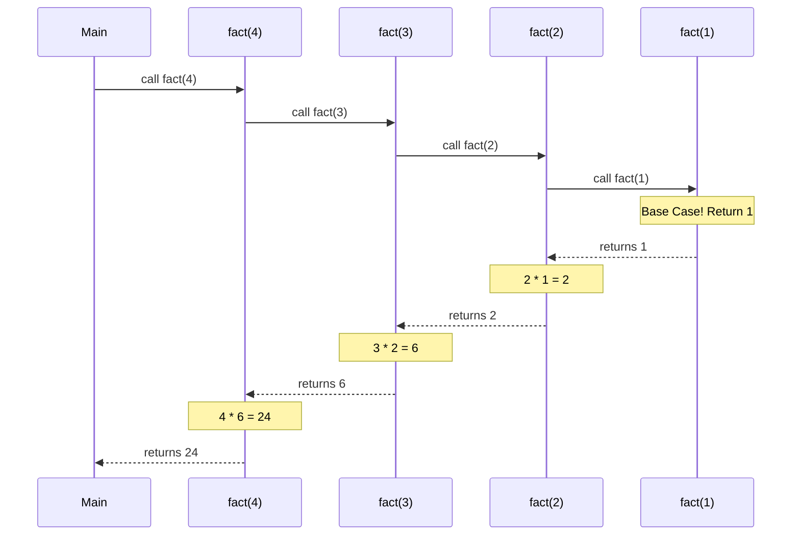

# Recursion — Visualization

## Diagram 1 — Recursion Tree for `fib(4)`

```mermaid
graph TD
    fib4["fib(4)"] --> fib3["fib(3)"]
    fib4 --> fib2["fib(2)"]
    fib3 --> fib2_2["fib(2)"]
    fib3 --> fib1["fib(1)"]
    fib2 --> fib1_2["fib(1)"]
    fib2 --> fib0["fib(0)"]
    fib2_2 --> fib1_3["fib(1)"]
    fib2_2 --> fib0_2["fib(0)"]

    style fib4 fill:#3498db,color:#fff
    style fib1 fill:#2ecc71,color:#fff
    style fib0 fill:#2ecc71,color:#fff
    style fib1_2 fill:#2ecc71,color:#fff
    style fib1_3 fill:#2ecc71,color:#fff
    style fib0_2 fill:#2ecc71,color:#fff
```

---

## Diagram 2 — Factorial `fact(4)` Execution Stack Tracing

```mermaid
sequenceDiagram
    participant Main
    participant f4 as fact(4)
    participant f3 as fact(3)
    participant f2 as fact(2)
    participant f1 as fact(1)

    Main->>f4: call fact(4)
    f4->>f3: call fact(3)
    f3->>f2: call fact(2)
    f2->>f1: call fact(1)
    Note over f1: Base Case! Return 1
    f1-->>f2: returns 1
    Note over f2: 2 * 1 = 2
    f2-->>f3: returns 2
    Note over f3: 3 * 2 = 6
    f3-->>f4: returns 6
    Note over f4: 4 * 6 = 24
    f4-->>Main: returns 24
```
