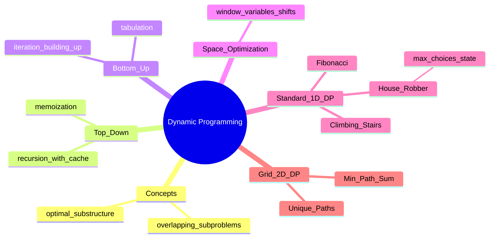

# Easy DP — Mind Map

```mermaid
mindmap
  root((Dynamic Programming))
    Concepts
      overlapping_subproblems
      optimal_substructure
    Top_Down
      memoization
      recursion_with_cache
    Bottom_Up
      tabulation
      iteration_building_up
    Space_Optimization
      window_variables_shifts
    Standard_1D_DP
      Fibonacci
      Climbing_Stairs
      House_Robber
        max_choices_state
    Grid_2D_DP
      Unique_Paths
      Min_Path_Sum
```
