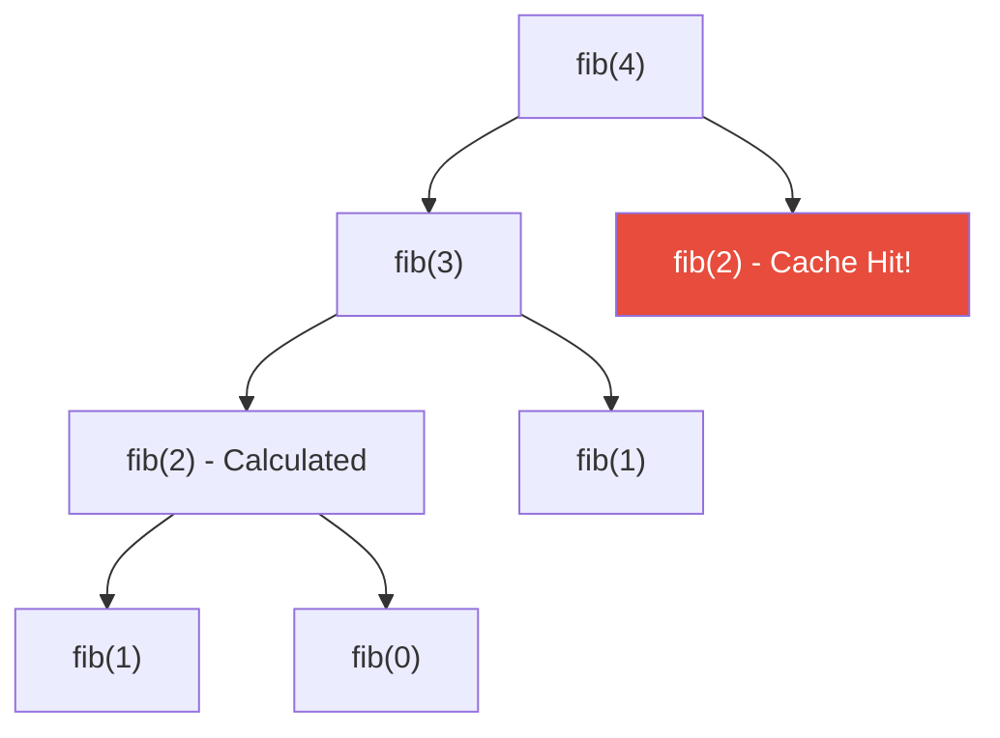
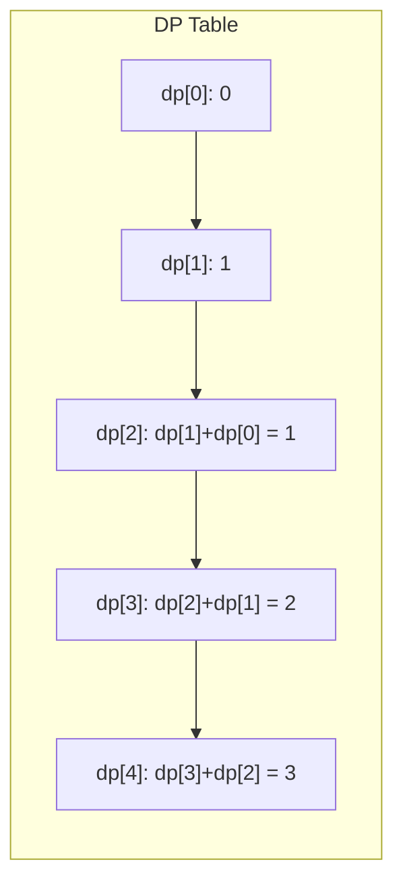

# Easy DP — Visualization

## Diagram 1 — Memoization vs Recursion (Overlapping states for `fib(4)`)

```mermaid
graph TD
    fib4["fib(4)"] --> fib3["fib(3)"]
    fib4 --> fib2["fib(2) - Cache Hit!"]
    fib3 --> fib2_2["fib(2) - Calculated"]
    fib3 --> fib1["fib(1)"]
    fib2_2 --> fib1_2["fib(1)"]
    fib2_2 --> fib0["fib(0)"]

    style fib2 fill:#e74c3c,color:#fff
```

---

## Diagram 2 — Bottom-up Tabulation Array Build

```mermaid
flowchart LR
    subgraph DP Table
        dp0["dp[0]: 0"] --> dp1["dp[1]: 1"]
        dp1 --> dp2["dp[2]: dp[1]+dp[0] = 1"]
        dp2 --> dp3["dp[3]: dp[2]+dp[1] = 2"]
        dp3 --> dp4["dp[4]: dp[3]+dp[2] = 3"]
    end
```
