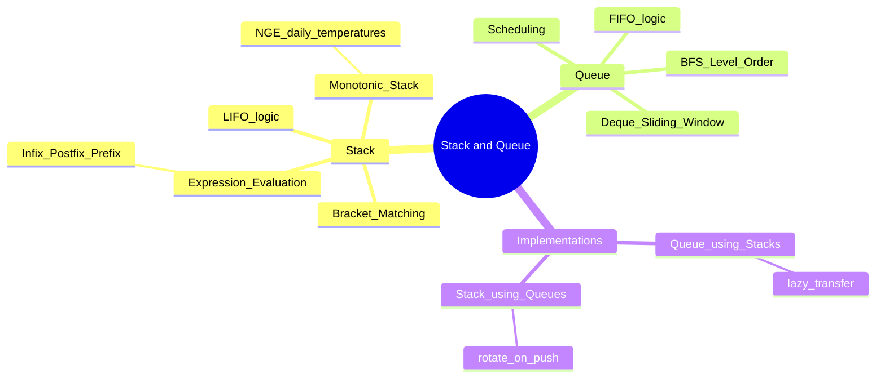

# Stack & Queue — Mind Map

```mermaid
mindmap
  root((Stack and Queue))
    Stack
      LIFO_logic
      Bracket_Matching
      Expression_Evaluation
        Infix_Postfix_Prefix
      Monotonic_Stack
        NGE_daily_temperatures
    Queue
      FIFO_logic
      Scheduling
      BFS_Level_Order
      Deque_Sliding_Window
    Implementations
      Queue_using_Stacks
        lazy_transfer
      Stack_using_Queues
        rotate_on_push
```
