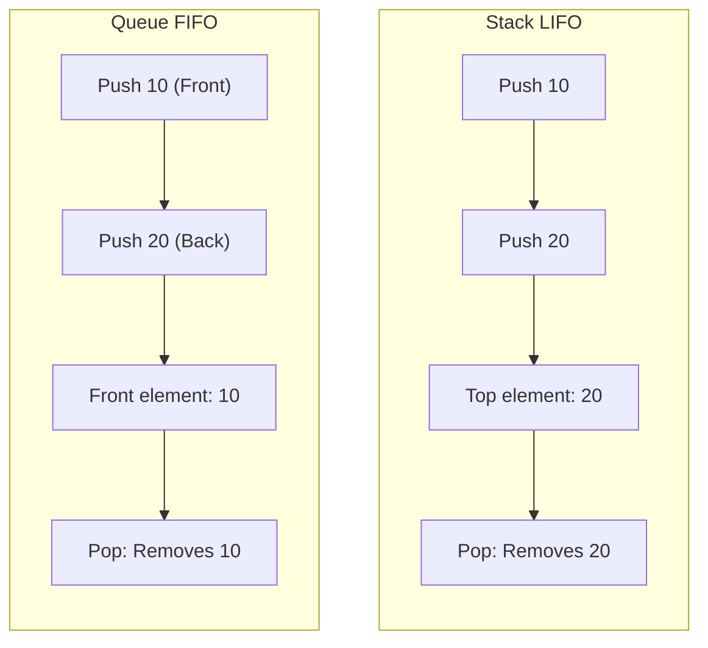
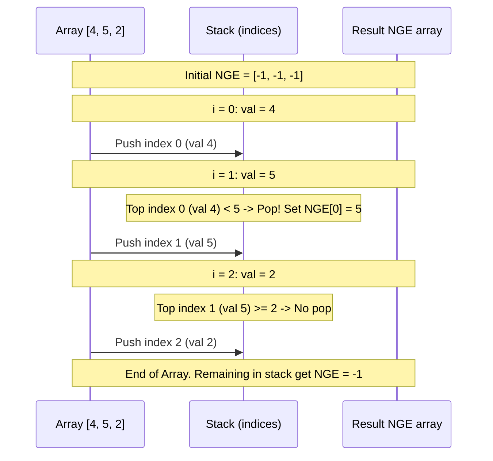

# Stack & Queue — Visualization

## Diagram 1 — LIFO Stack vs FIFO Queue Operations

```mermaid
flowchart TD
    subgraph Stack LIFO
        direction TB
        s1["Push 10"] --> s2["Push 20"]
        s2 --> s3["Top element: 20"]
        s3 --> s4["Pop: Removes 20"]
    end
    subgraph Queue FIFO
        direction TB
        q1["Push 10 (Front)"] --> q2["Push 20 (Back)"]
        q2 --> q3["Front element: 10"]
        q3 --> q4["Pop: Removes 10"]
    end
```

---

## Diagram 2 — Monotonic Stack Trace for NGE: `[4, 5, 2]`

```mermaid
sequenceDiagram
    participant Arr as Array [4, 5, 2]
    participant St as Stack (indices)
    participant NGE as Result NGE array

    Note over Arr, NGE: Initial NGE = [-1, -1, -1]
    Note over Arr, NGE: i = 0: val = 4
    Arr->>St: Push index 0 (val 4)
    Note over Arr, NGE: i = 1: val = 5
    Note over St: Top index 0 (val 4) < 5 -> Pop! Set NGE[0] = 5
    Arr->>St: Push index 1 (val 5)
    Note over Arr, NGE: i = 2: val = 2
    Note over St: Top index 1 (val 5) >= 2 -> No pop
    Arr->>St: Push index 2 (val 2)
    Note over Arr, NGE: End of Array. Remaining in stack get NGE = -1
```
