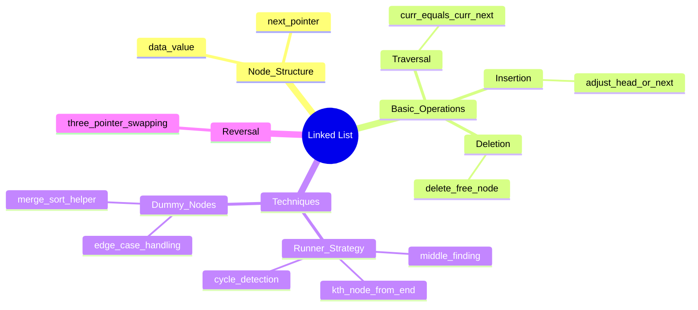

# Linked List — Mind Map

```mermaid
mindmap
  root((Linked List))
    Node_Structure
      data_value
      next_pointer
    Basic_Operations
      Traversal
        curr_equals_curr_next
      Insertion
        adjust_head_or_next
      Deletion
        delete_free_node
    Techniques
      Runner_Strategy
        middle_finding
        cycle_detection
        kth_node_from_end
      Dummy_Nodes
        edge_case_handling
        merge_sort_helper
    Reversal
      three_pointer_swapping
```
 obituary.
