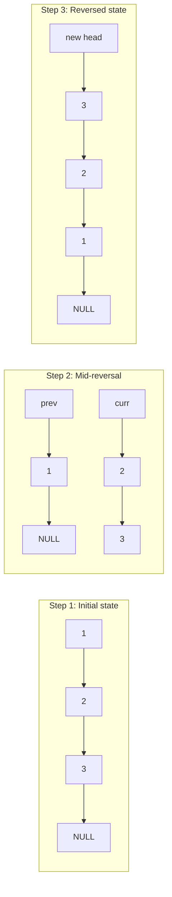

# Linked List — Visualization

## Diagram 1 — Singly Linked List Reversal Steps



---

## Diagram 2 — Floyd's Cycle Detection meeting trace

```mermaid
graph LR
    Head["Head: 1"] --> Node2["2"] --> Node3["3 (Cycle Start)"] --> Node4["4"] --> Node5["5"] --> Node3

    style Node3 fill:#e74c3c,color:#fff
    style Node5 fill:#f39c12,color:#fff
    Note over Node5: Slow & Fast meet here
```
*(Slow moves 1-2-3-4-5, Fast moves 1-3-5-4-3-5. They meet at node 5).*
 obituary.
