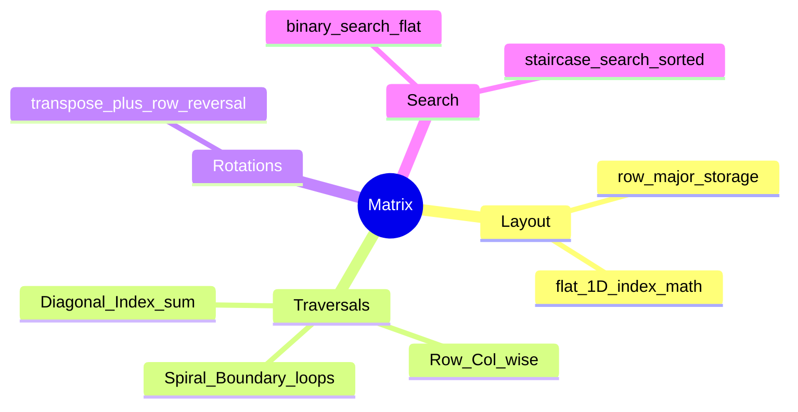

# Matrix — Mind Map

```mermaid
mindmap
  root((Matrix))
    Layout
      row_major_storage
      flat_1D_index_math
    Traversals
      Row_Col_wise
      Spiral_Boundary_loops
      Diagonal_Index_sum
    Rotations
      transpose_plus_row_reversal
    Search
      binary_search_flat
      staircase_search_sorted
```
