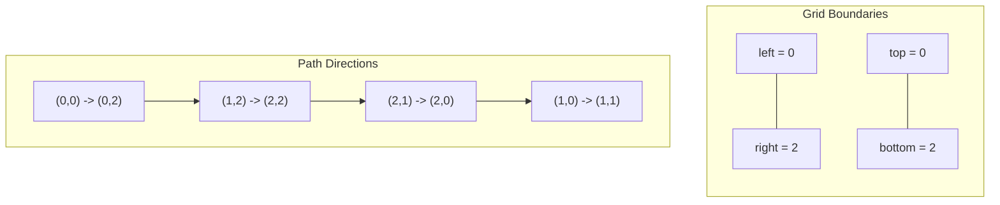

# Matrix — Visualization

## Diagram 1 — Spiral Traversal Ring Boundaries



---

## Diagram 2 — Matrix Transposition Swap Cells

```mermaid
matrix
  | 1  2  3 |         | 1  4  7 |
  | 4  5  6 |   ==>   | 2  5  8 |
  | 7  8  9 |         | 3  6  9 |
```
*(Swap elements across main diagonal: 2<->4, 3<->7, 6<->8).*
