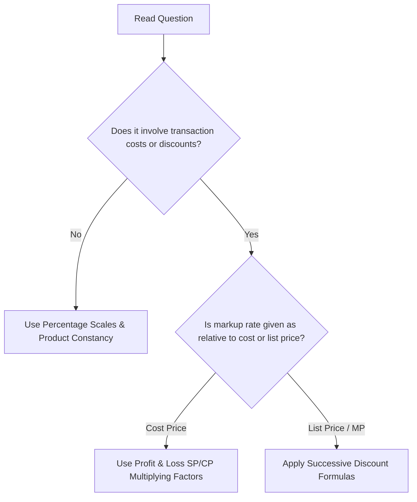

# TCS NQT 2026: Master Shortcuts Guide

This guide compiles high-speed shortcuts and decision trees to help you solve problems within the 75-second TCS time limit.

---

## 🗺️ Topic Decision Trees (Visual Guide)

### 1. Percentages vs. Profit & Loss Choice
Determine whether to solve using pure percentage scales or Profit & Loss CP-SP relations.


### 2. Simple Interest vs. Compound Interest
Decide between linear accrual methods or successive compounded multipliers.
```mermaid
graph TD
    A[Read Interest Problem] --> B{Is interest added to principal each period?}
    B -- No --> C[Apply Linear SI: SI = PRT/100]
    B -- Yes --> D{Is the time duration exactly 2 or 3 years?}
    D -- Yes --> E[Use Direct Difference Formulas: D2 or D3]
    D -- No --> F[Apply Multiplier Chains: Amount = P * (1 + R/100)^T]
```

### 3. Permutation vs. Combination Choice
Choose whether to use selections ($nCr$) or ordered arrangements ($nPr$).
```mermaid
graph TD
    A[Read Counting Problem] --> B{Does the order of selected items matter?}
    B -- No --> C[Use Combination: nCr (Teams, Cards, Handshakes)]
    B -- Yes --> D{Are items arranged in a circle or line?}
    D -- Line --> E[Use Permutation: nPr (Word arrangements, digits)]
    D -- Circle --> F[Use Circular Permutation: (n-1)!]
```

### 4. Two-Pointers vs. Sliding Window (Coding)
Identify whether to use two independent boundaries or a dynamic window.
```mermaid
graph TD
    A[Read Coding Question] --> B{Is the input array sorted?}
    B -- Yes --> C[Use Two-Pointers (left & right indices matching target)]
    B -- No --> D{Are we looking for a contiguous subarray?}
    D -- Yes --> E[Use Sliding Window (expanding right, shrinking left)]
    D -- No --> F[Consider Hashing or Sorting]
```

### 5. Hashing vs. Sorting (Coding)
Determine whether to trade memory for lookup speed or reorganize the inputs.
```mermaid
graph TD
    A[Identify Array Requirement] --> B{Do we need O(1) frequency checks or lookups?}
    B -- Yes --> C[Use Hash Map / Hash Set (unordered_map)]
    B -- No --> D{Do we need elements in order or median?}
    D -- Yes --> E[Sort Array first: O(N log N)]
    D -- No --> F[Single O(N) scan using pointers or prefix sums]
```

---

## ⚡ Section-Wise Shortcut Sheets

### 1. Numerical Ability

#### CP-SP Article Count Shortcut
- **Condition**: Cost Price of $X$ articles is equal to Selling Price of $Y$ articles.
- **Shortcut Formula**:
  $$\text{Profit or Loss \%} = \frac{X - Y}{Y} \times 100$$
  If result is positive, it's a Profit; if negative, it's a Loss.
- **Worked Example**: CP of 15 pens = SP of 12 pens.
  $$\text{Profit \%} = \frac{15 - 12}{12} \times 100 = \frac{3}{12} \times 100 = 25\%$$

#### Dishonest Dealer Error Shortcut
- **Condition**: Dealer sells goods at cost price but uses a false weight.
- **Shortcut Formula**:
  $$\text{Gain \%} = \frac{\text{Error}}{\text{True Value} - \text{Error}} \times 100$$
- **Worked Example**: Seller uses $800\text{g}$ instead of $1\text{kg}$. Here, $\text{Error} = 200\text{g}$.
  $$\text{Gain \%} = \frac{200}{1000 - 200} \times 100 = \frac{200}{800} \times 100 = 25\%$$

#### Multiplying Factor for Percentage Changes
- **Condition**: Repeated percentage updates on a base amount.
- **Shortcut**: Represent increase of $P\%$ as multiplier $(1 + P/100)$ and decrease as $(1 - P/100)$.
- **Worked Example**: Salary $15000$ increases by $20\%$, then decreases by $10\%$.
  $$\text{Final Salary} = 15000 \times 1.2 \times 0.9 = 15000 \times 1.08 = 16200$$

---

### 2. Advanced Section

#### Sum of First $N$ Odd Numbers
- **Condition**: Consecutive odd integer summation starting from 1.
- **Shortcut**:
  $$\text{Sum} = N^2$$
- **Worked Example**: Sum of first 50 odd numbers is $50^2 = 2500$.

#### Logarithm Base Reducer
- **Condition**: Evaluating $\log_{b^k} a^m$.
- **Shortcut**:
  $$\log_{b^k} a^m = \frac{m}{k} \log_b a$$
- **Worked Example**: Evaluate $\log_8 16 \implies \log_{2^3} 2^4 = \frac{4}{3} \log_2 2 = \frac{4}{3}$.

---

### 3. Reasoning Ability

#### Weekday Shift Year-to-Year
- **Condition**: Calendar day calculations.
- **Shortcut**: Moving forward one ordinary year shifts the weekday by $+1$. Moving forward one leap year shifts the weekday by $+2$.
- **Worked Example**: If March 15, 2021 was Monday, then March 15, 2022 is Tuesday ($+1$). March 15, 2024 is Friday ($+3$, since 2024 is a leap year containing Feb 29).

#### Angle of Coincidence (Clocks)
- **Condition**: Finding when clock hands coincide ($0^\circ$ difference).
- **Shortcut**: Hands coincide every $65 \frac{5}{11}$ minutes.
- **Worked Example**: To find when hands coincide between 3 and 4 o'clock:
  $$\text{Time} = 3 \times \frac{60}{11} = \frac{180}{11} = 16 \frac{4}{11} \text{ minutes past } 3$$

---

### 4. Verbal Ability

#### Subject-Verb Agreement with Proximity
- **Condition**: Nouns connected by "either... or...", "neither... nor...", or "or".
- **Shortcut**: The verb agrees with the **closest** subject.
- **Worked Example**:
  *Incorrect*: "Neither the manager nor the employees is attending."
  *Correct*: "Neither the manager nor the employees **are** attending." (verb agrees with plural "employees").

---

### 5. Coding Section

#### Array Reversal Rotation
- **Condition**: Rotate array of size $N$ to the right by $K$ steps.
- **Shortcut**: Swap boundaries inwards in three steps:
  ```cpp
  // k = k % n;
  reverse(arr, arr + n);
  reverse(arr, arr + k);
  reverse(arr + k, arr + n);
  ```
- **Worked Example**: Rotate $[1, 2, 3, 4, 5]$ by $K=2$:
  1. Reverse all: $[5, 4, 3, 2, 1]$
  2. Reverse first 2: $[4, 5, 3, 2, 1]$
  3. Reverse rest: $[4, 5, 1, 2, 3]$ (Correct result in $O(N)$ time, $O(1)$ space).
